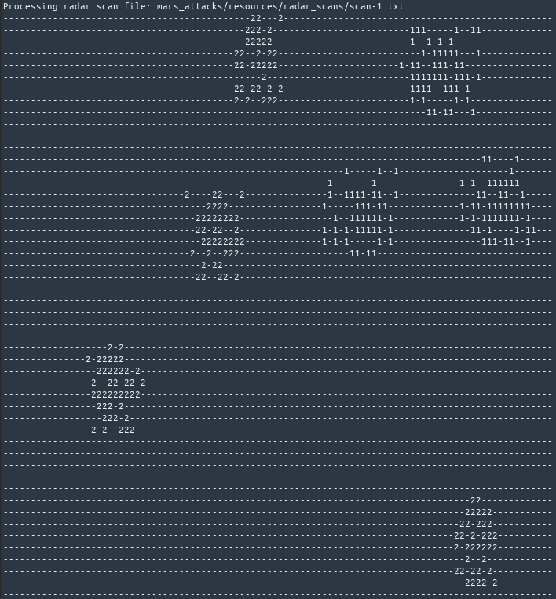

# Invaders Tracker

Space invaders are upon us!

This application takes a radar sample as an argument and reveals possible locations of those pesky invaders.

## Installation

Recommended way of installation is to use Docker Compose. It gives you a great separation from your local environment.
- Install Docker Compose: https://docs.docker.com/compose/install/
- Run: `docker-compose build`

Alternatively use Poetry with Python 3.9
- Install Poetry: https://python-poetry.org/docs/#installation
- Run: `poetry install`

## Running Tests

- Docker: `docker-compose run --rm tracker poetry run pytest`

or
- Poetry: `poetry run pytest`

## Running Tracker

- Docker: `docker-compose run --rm tracker poetry run mars mars_attacks/resources/radar_scans/scan-1.txt`

or
- Poetry: `poetry run mars mars_attacks/resources/radar_scans/scan-1.txt`

Notes:
- change the `ratio` parameter in the `config.ini` for less or more strict similarity.
- change repository paths in the `config.ini` to load files from different locations
(you don't want to change that in case you use docker since all paths would be internal to the container).

Sample output should be:

## Implementation Details

### System Architecture
Project's architecture is based on the [Clean Architecture](https://blog.cleancoder.com/uncle-bob/2012/08/13/the-clean-architecture.html).
By dividing application into layers we get a system where business logic is independent of frameworks, UI or data sources.
It's also easier to test.

#### Structure

    |- mars_attacks
      |- entrypoints
         |-__main__.py - application's entrypoint, can be replaced by a web framework etc.
         |-containers.py - dependency injector configuration
      |- foundation - common modules
      |- resources - radar scans and invader patterns
      |- tracking - tracking logic
         |- adapters - data sources
         |- domain - business entities definitions
         |- renderers - presenter(s)
         |- trackers - pattern tracker(s)
         |- use_cases - actual business logic
    |- tests - tests suite
    |- config.ini - app's configuration used by dependency injector

#### Key elements

- Business logics is completely decoupled from implementation details. Dependency injector is used to inject
trackers, renderers or data sources. Use of different implementations is just a configuration thing.
- Trackers, renderers and repositories (data sources) base on abstract classes (Interfaces) that dictate how concrete
implementations should look like. Thanks to that it's easy to replace filesystem based repositories with db based ones,
to use trackers that implement different search algorithms as well as to build different presenters that for example can output results into a file. 

### Tracking Algorithm
Invaders tracking implementation is based on the following concepts and assumptions:
- sliding window that moves over the radar scan,
- similarity matching is done for every window for every invader,
- padding is applied to the radar scan to include possible partial matches around the edges.
- no image processing (opencv etc.) or scientific libs other than bare numpy and Levenhstein lib are used.

Known Algorithm Issues
- Padding is only applied once for the biggest height and weight of patterns. This makes implementation simpler but
also adds some empty runs for smaller patterns that will not have any match.
- Numpy stride_tricks' `sliding_window_view` that is used here is only fine for smaller tasks
or prototyping. More on that in the Notes section in the function's docs.
- Overlaps of matching patterns can happen especially with lower ratios.
- No support for rotated invaders - we assume that they have no steering wheels.

### To Do
- Add more extensive test cases, especially for different edge cases
- Implement better trackers - faster and more accurate. The one here is clearly not optimal but at least does its job.
Thankfully the architecture makes it simple to replace it with a one build by an experienced data scientist.

### Other Comments
- The most challenging part of the task was the tracking algorithm. For someone who's not much into the pattern/template
matching topic it required a lot of reading and learning... just to understand in the end that due to the limited amount
of time and assumptions made I need to go with something very simple.
- While the algorithm could be implemented with plain Python I decided to use numpy because I consider it a standard
dependency for array and matrix heavy tasks. It was also a nice learning experience since it's not a lib that I
have used much so far in the non-data science oriented world.
- Code is formatted with [Black](https://github.com/psf/black).